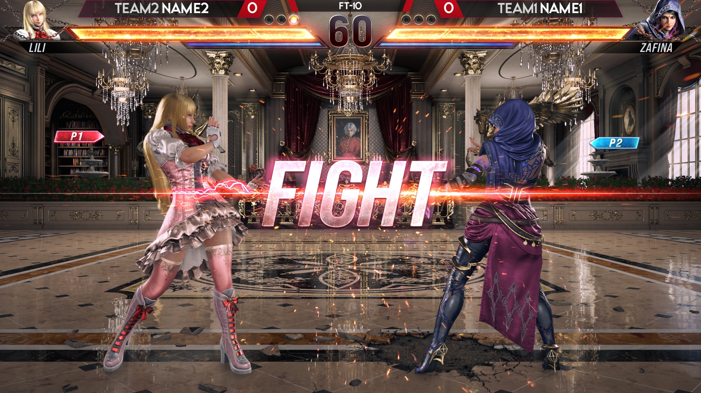
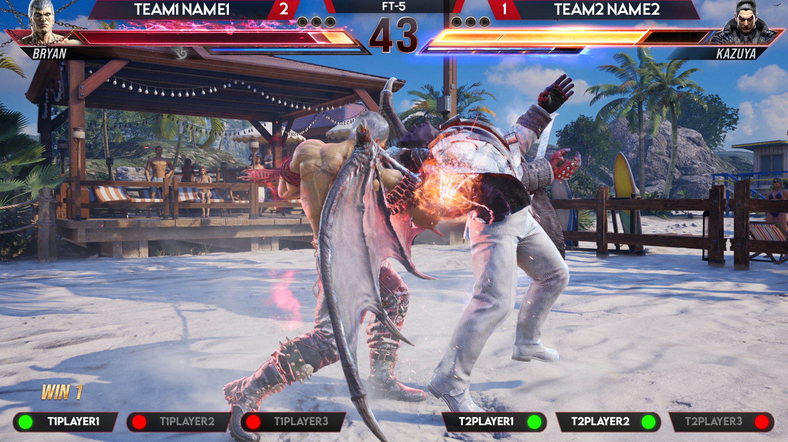
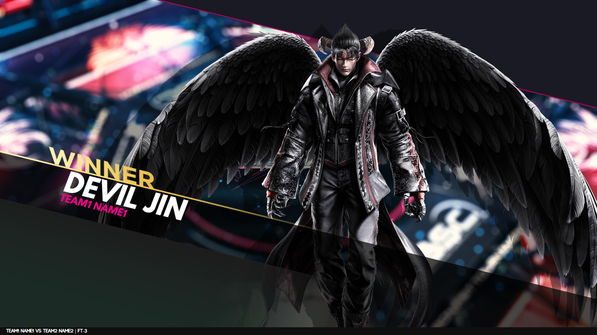
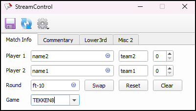
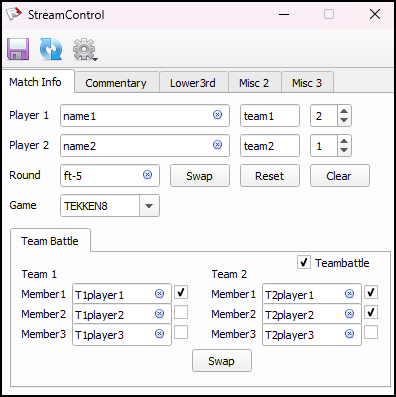
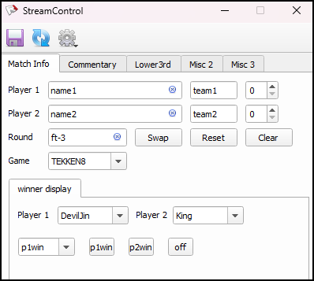

<h1 align="center">
  
FG Overlay
  
</h1>

<h4 align="center">A minimal Fighting game scoreboard overlay.</h4>

 

  <a href="#About">About</a> •
  <a href="#how-to-use">How To Use</a> •
  <a href="#screenshots">Screenshots</a> •
  <a href="#notes">Notes</a> •
  <a href="#license">License</a>

## About

Fighting game scoreboard overlay (Tekken 8) designed for the tournament stream using HTML and JavaScript. Overlay is based on a browser source.
StreamControl generates a JSON file that is read by an HTML overlay, styled, animated, and presented using JavaScript. 

>Also works with UMVC3, DragonballFZ, SkullGirls, KOFXIV, TEKKEN 7, GuiltyGear-Strive, SF6, UNIST

## How To Use

To download file hit the code button and download zip

Add an HTML file to the browser source of your streaming program, and use StreamControl to provide overlay data and controls. 

There are three folders, each with a unique layout.

1.scoreboard only  (ScoreBoard.html)
2.scorboard + teambattle(3v3)  (ScoreBoard.html)
3.scoreboard and winner display   (ScoreBoard.html and windisplay.html)

The winner's name and character appear on an animated splashscreen. It contains a separate HTML file.
 

> **Note**
> ⭕ Each folder have its own streamcontrol with diffrent layout in streamcontrol folder

>⭕ when using scoreboard and winner display, You must add windisplay.html and scoreboard.html to two separate browser sources in order, with windisplay being the top layer.

## Screenshots

ScoreBoard           |  ScoreBoard + Teamnbattle       | ScoreBoard & Winner Display
:-------------------------:|:-------------------------:|:----------------------
  |  | 

## Notes

>Winner-Display is in experimental state may not be optimised, may lag or shutter.

*By modifying a CSS file, you can alter the font and colour of the text.

*By referencing a png file for the overlay, you can modify the design and create your own.

>🛑Important :To remove the logo at the bottom, erase the logo png files.Additionally, you can replace them with your own logo with same dimension

## Thankyou

[farpenoodle's StreamControl](https://github.com/farpenoodle/StreamControl) - StreamControl

## Future Goals
* Lowerthird
* Brackets
* Flags
* New Design for layout
* Adjust for other games

## License

MIT

## github.com/Y3S99